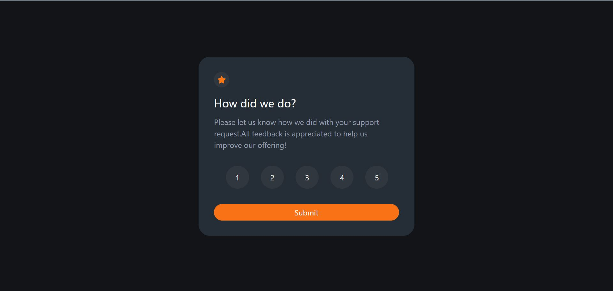

# Frontend Mentor - Interactive rating component

This is a solution to the [Interactive rating component challenge on Frontend Mentor](https://www.frontendmentor.io/challenges/interactive-rating-component-koxpeBUmI). Frontend Mentor challenges help you improve your coding skills by building realistic projects.

## Table of contents

- [Overview](#overview)
- [The challenge](#the-challenge)
- [Screenshot](#screenshot)
- [Links](#links)
- [Built with](#built-with)
- [What I learned](#what-i-learned)
- [Useful resources](#useful-resources)
- [Author](#author)

## Overview

This is my first challenge from frontendmentor.io , it is a very good website to brush up your skills, you can use any tools you want to complete this project . This application was developed using react , react-router and tailwind-css

### The challenge

Users should be able to:

- View the optimal layout for the app depending on their device's screen size
- See hover states for all interactive elements on the page
- Select and submit a number rating
- See the "Thank you" card state after submitting a rating

### Screenshot

### Links

- Solution URL: [Add solution URL here](https://github.com/DhairyaSehgal07/Interactive_Rating_Component)
- Live Site URL: [Add live site URL here](https://interactiverating07.netlify.app/)

### Built with

- Semantic HTML5 markup
- CSS custom properties
- Flexbox
- Mobile-first workflow
- [React](https://reactjs.org/) - JS library
- [Tailwind css](https://tailwindcss.com/) - For styles

### What I learned

Since , i am a beginner, i got to learn Lifting state up in react from this project , i needed to pass the state from one component to another , that was a tricky part. I am not sure of my responsive code.Overall it is a really godd project for beginners

### Useful resources

- [React dev docs](https://react.dev/) - This helped me to gain an understanding of react hooks -[React router](https://reactrouter.com/en/main)- This helped me to gain an understanding of how routing works in react
- [Tailwind css docs](https://tailwindcss.com/) - This is an amazing article which helped me find the suitable styles for my components.It also helped me with the syntax of tailwind css

## Author

- Website - [Dhairya Sehgal](https://dhairya-sehgal-portfolio.netlify.app/)
- Frontend Mentor - [@DhairyaSehgal07](https://www.frontendmentor.io/profile/DhairyaSehgal07)
